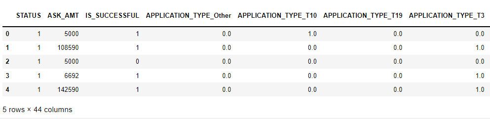
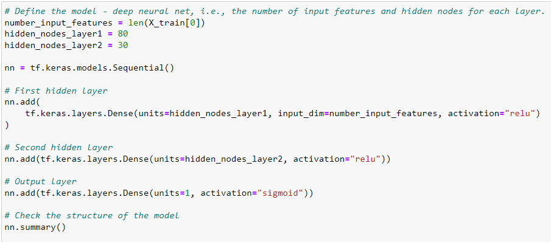
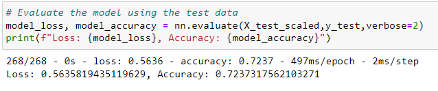
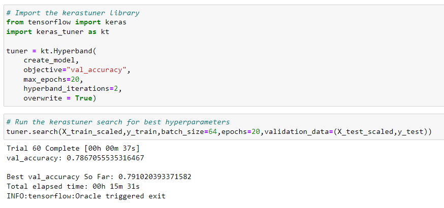
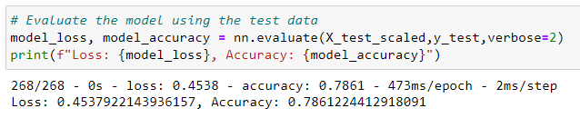

# Neural_Network_Charity_Analysis
Neural Networks/Deep Learning

# Amazon_Vine_Analysis

## Table of Contents
- [Overview of Project](#OverviewProject)
  * [Background](#Background)
  * [Purpose](#purpose)
- [Results](#results)
  * [Data Preprocessing](#preprocessing)
  * [Compiling, Training, and Evaluating the Model](#evaluating)
  * [Optimizing the Model](#optimize)
- [Analysis Summary](#Summary)
- [Resources](#resources)
- [References](#references)

## Overview of Project
### Background

Alphabet Soup is a non-profit philanthropic organization dedicated to helping organizations that protect the environment and prove peoples well being and unify the world. It has donated over 10 billion dollars over the past 20 years. This money has been used to invest in life saving technologies and organize reforestation groups around the world. 

### Purpose

My job is to analyze the impact of each donation and vet potential receipients. This helps ensure that the foundations money is being used effectively. Unfortunately not every donation the company makes is impactful. In some cases an organization will take the money and disappear. As a result, my job is to predict which organizations are worth donating to and which are too high risk. We need to create a mathematical, data driven solution that can do this accurately. 
For this pupose I am using a **Artificial Neural Network or ANN**. This model will evaluate all types of input data and produce a clear decision making result. While using **Python TensorFlow library**, we will try to test and optimize the model. This model will help us decide which organizations should receive donations.
 
### Results

### Data Preprocessing

**Target variable for our model**

For this dataset 'IS_SUCCESSFUL" is the target column. This column is '1', if the money donated was used effectively and '0' otherwise. 

**Features for our model**

The features for our dataset are the following:

* APPLICATION_TYPE — Alphabet Soup application type
* AFFILIATION — Affiliated sector of industry
* CLASSIFICATION — Government organization classification
* USE_CASE — Use case for funding
* ORGANIZATION — Organization type
* STATUS — Active status
* INCOME_AMT — Income classification
* SPECIAL_CONSIDERATIONS — Special consideration for application
* ASK_AMT — Funding amount requested

**Variables removed from the input dataset**

While doing the preprocessing I removed 2 variables from the dataset. They are "EIN" and "NAME". These are identification columns hence have been removed.

- Binned the following categorical variables - "APPLICATION_TYPE", "CLASSIFICATION" in order to reduce some noise in the dataset.
- Since, the neural network models can only take numerical data, I transformed all the categorical text columns to numeric by doing **One Hot Encoding**.
- The next step is to split the preprocessed data into a train and test dataset.
- Finally, I scaled the train dataset using Standard Scalar.  

  
  

 **Snapshot of dataset after One Hot Encoding** 
 

###  Compiling, Training, and Evaluating the Model

* While building the model I have used 2 hidden layers.
* The first layer included **80** neurons, whereas the second hidden layer included **30** neurons.
* **Activation function** used on both the **hidden layers** was -**RELU**. I used RELU as it is good at finding non-linear data points in our dataset.
* **Activation function** used on the **Output layer** is - **Sigmoid**. I used Sigmoid as we need to predict which organizations should receive donations. This is a binary Classification problem.
* The **optimizer** used on the output layer is - **adam**. The Adam optimization algorithm is an extension to stochastic gradient descent and can handle sparse gradients on noisy problems.
* The **Loss function** used on the output layer is - **Binary crossentropy** as this is a binary classification problem.
* Also, I used 100 epochs to train my model and got an accuracy score of **72%** and a loss of **0.56**

  
  

 **Defining the Model and its layers** 
  

Accuracy achieved - 72% 

  
  

 **Accuracy score - Before optimization** 
 

###  Optimizing the Model

In order to optimize the model I did the following:

* Initially we had deleted the "NAME" column thinking it to be an identification column. But after evaluating this column, I found out this column includes the names of the organizations that have been granted the donations a number of times. Hence, I included this column in our dataset.
* Binned the "Name"column to reduce noise in the dataset.
* "APPLICATION_TYPE" and "CLASSIFICATION" columns were binned as before. 
* In order to optimize the model I have used the Keras Tuner to decide on the number of hidden layers, number of neurons and the activation function for each layer.

  
  

 **Code for tuning the model using KerasTuner** 
 

* After tuning the model, I was able to achieve an accuracy score of 79%.

  
  

 **Accuracy score - After optimization** 
 

## Analysis Summary
With an accuracy core of 78.6%, this model is only moderately successful in predicting which organizations should be approved to receive donations. Even after optimizing the model I was not successful in increasing the accuracy score. I would highly recommend to use a supervised learning model like the Random Forest or ADA Boost to run the predictions.

##  Resources
[1] [Charity Dataset](Resources/charity_data.csv)  
[2] [Alphabet Soup Charity Code](AlphabetSoupCharity.ipynb)  
[3] [Alphabet Soup Charity Optimized Code](AlphabetSoupCharity_Optimization.ipynb)

[2] Language:
* Python  

[3] Software: 
* Jupyter Notebook  

[4] Libraries: 
* Pandas  
* Scikit-learn  
* Tensorflow 
 
 ##  References

 https://www.freecodecamp.org/news/deep-learning-neural-networks-explained-in-plain-english/

 https://stackoverflow.com/questions/59069058/save-model-every-10-epochs-tensorflow-keras-v2